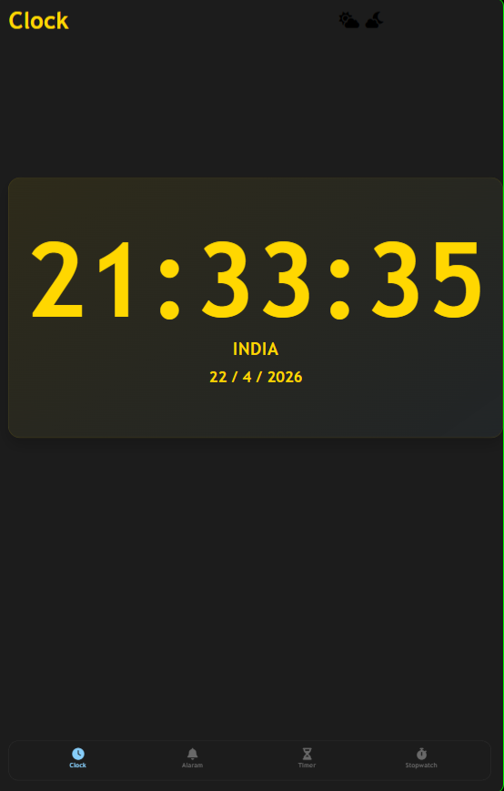
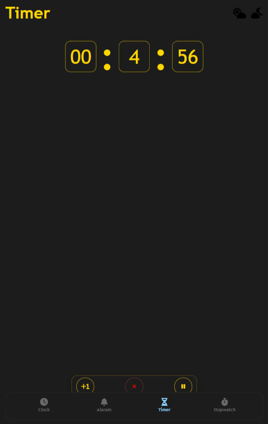
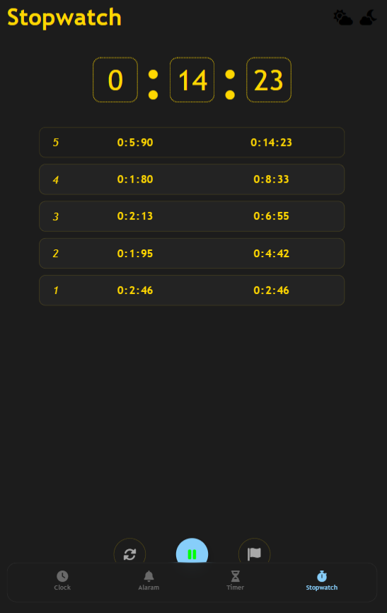
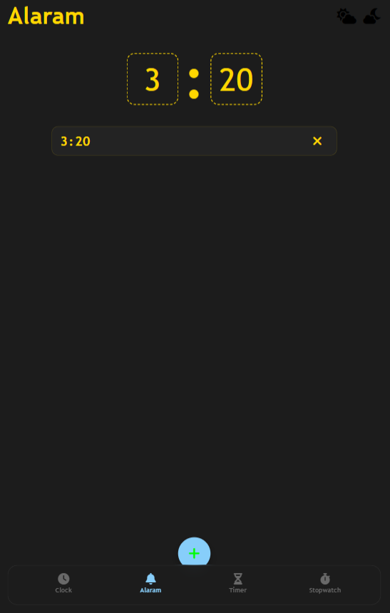

# Multi-Tool Clock Web App

A browser-based multi-tool clock application built using **HTML, CSS, and Vanilla JavaScript**.

This app combines multiple time-related utilities into a single, clean interface:

- Live Digital Clock  
- Alarm  
- Timer  
- Stopwatch  

---

## Live Demo

 https://rudra1337-dev.github.io/Clock-APP/

---

## Screenshots

<!-- 📌 ADD YOUR SCREENSHOTS HERE -->

  
  
  
  

---

## Features

-  Real-time digital clock using JavaScript `Date` object  
-  Alarm with sound and notification  
-  Timer with start, pause, resume, cancel, and +1 minute control  
-  Stopwatch with lap tracking  
-  Responsive design (mobile + desktop)  
-  Light/Dark theme toggle  
-  Sound feedback on touch  
-  Device vibration support (if supported by browser)  
-  Single-page navigation between tools  

---

## Tech Stack

- HTML5  
- CSS3  
- JavaScript (Vanilla)  
- Font Awesome  

---

## Project Structure

```text
Clock-APP/
├── index.html
├── page.css
├── clock.css
├── alarm.css
├── timer.css
├── stopwatch.css
├── page.js
├── time.js
├── alarm.js
├── timer.js
├── stopwatch.js
├── ALARM.mp3
├── TIMER.mp3
└── TOUCH.wav
```
---

## How To Run

### Option 1: Open Directly
Open `index.html` in your browser.

### Option 2: Using Live Server
1. Open the project in VS Code  
2. Right-click `index.html`  
3. Click **Open with Live Server**  

---

## How It Works

### Navigation
- Footer is used to switch between Clock, Alarm, Timer, and Stopwatch  
- Controlled using `page.js`  

### Clock
- Updates every second using JavaScript `Date`  
- Displays time and date in real-time  

### Alarm
- User sets hour and minute  
- When time matches → sound + vibration + notification  

### Timer
- Countdown timer with controls:
  - Start / Pause / Resume  
  - +1 Minute  
  - Cancel  

### Stopwatch
- Start, pause, reset functionality  
- Lap tracking with:
  - Lap number  
  - Time difference  
  - Total elapsed time  

---

## Audio Used

- `TOUCH.wav` → button feedback  
- `ALARM.mp3` → alarm sound  
- `TIMER.mp3` → (reserved for timer completion)  

---

## Current Limitations

- No data persistence (refresh resets everything)  
- Alarm works only in-memory  
- Timer/Stopwatch state not saved  
- Vibration works only on supported devices  
- Timezone API currently disabled  

---

## Future Improvements

- Add `localStorage` support  
- Multiple alarms support  
- AM/PM format  
- Timezone selection  
- Timer completion sound  
- Accessibility improvements  

---

## What I Learned

- DOM manipulation using JavaScript  
- Handling real-time events (clock, timer, alarm)  
- Managing multiple features in a single-page app  
- Writing modular JavaScript code  
- Responsive UI design  

---

## Author

**Rudra**  
BTech CSE Student | Aspiring Software Engineer  

🔗 https://github.com/rudra1337-dev  
🔗 https://rudra1337-dev.vercel.app
